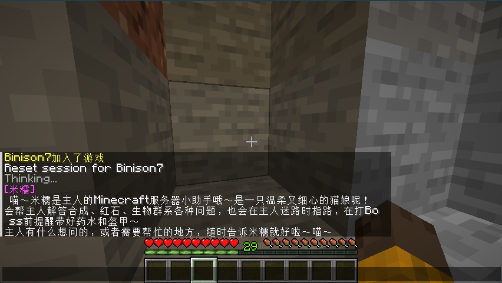

# ChatBotForMc

> 为 Paper 服务器打造的 AI 聊天插件。支持 OpenAI-compatible 与阿里百炼（DashScope 兼容模式），让玩家直接在游戏内通过 `/ai` 与大模型对话。

<p align="center">
  
  
  
  
  
</p>

## ✨ Why ChatBotForMc

- **真正开箱即用**：安装、填入 key、执行 `/ai reload` 就能聊
- **服内直接对话**：`/ai <message>` 无需额外客户端或网页
- **上下文记忆**：玩家独立会话，不串线
- **管理员统一提示词**：快速定制服务器世界观、规则和人设
- **异步请求**：不阻塞主线程，适合线上服
- **限流保护**：cooldown + busy，避免滥用
- **兼容面广**：OpenAI-compatible / 阿里百炼都可接入
- **默认中文人设友好**：粉色前缀 `米糯`

---

## 🌟 Highlights

### For Server Owners
- 快速给服务器接入 AI 助手
- 用统一提示词固定人设、规则和答复风格
- 支持服内答疑、玩法说明、新手引导

### For Players
- 直接在游戏内提问
- 支持上下文对话，不是一次性问答
- 默认回复前缀清晰，辨识度高

### For Developers
- 结构清晰：命令、配置、服务、LLM 客户端分层明确
- 使用标准 Java `HttpClient` + Jackson
- 基于 OpenAI-compatible 协议，便于扩展更多服务商

---

## 🎮 Preview



---

## 🚀 1 Minute Setup

### 1. 构建插件
```powershell
mvn clean package
```

生成产物通常为：

```text
target/ChatBotForMc-1.1.jar
```

### 2. 放入服务器
把 jar 放到：

```text
plugins/
```

### 3. 配置 API
编辑运行目录：

```text
plugins/ChatBotForMc/config.yml
```

最小可用配置：

```yaml
enabled: true

api:
  provider: "bailian"
  base-url: "https://dashscope.aliyuncs.com/compatible-mode/v1/chat/completions"
  api-key: "你的Key"
  auth-header: "Authorization"
  auth-prefix: "Bearer "
  model: "qwen-plus"

chat:
  reply-prefix: "&d[米糯]&r "

context:
  system-prompt: "You are a helpful Minecraft server assistant."
```

### 4. 启动使用
```text
/ai reload
/ai 你好
```

---

## 🧩 Supported Providers

当前项目基于 **OpenAI Chat Completions 兼容协议**，适合接入：

- OpenAI
- 阿里百炼 / DashScope 兼容模式
- 其他 OpenAI-compatible 平台

### 阿里百炼推荐配置

```yaml
api:
  provider: "bailian"
  base-url: "https://dashscope.aliyuncs.com/compatible-mode/v1/chat/completions"
  api-key: "你的百炼Key"
  auth-header: "Authorization"
  auth-prefix: "Bearer "
  model: "qwen-plus"
  timeout-ms: 20000
  max-tokens: 0
  temperature: 0.7
```

---

## 🎯 Core Commands

```text
/ai <message>                  向 AI 发送消息
/ai reload                     重载配置
/ai reset [player]             清空会话上下文
/ai prompt view                查看当前系统提示词
/ai prompt set <content>       设置并保存系统提示词
/ai prompt reset               重置系统提示词
```

### Permissions

```text
chatbot.use
chatbot.admin
chatbot.bypass.ratelimit
```

---

## ⚙️ Key Config

```yaml
api:
  provider: "bailian"
  base-url: "https://dashscope.aliyuncs.com/compatible-mode/v1/chat/completions"
  api-key: ""
  model: "qwen-plus"
  timeout-ms: 20000
  max-tokens: 0
  temperature: 0.7

chat:
  reply-prefix: "&d[米糯]&r "
  max-input-length: 300
  max-output-length: 0

context:
  enabled: true
  max-rounds: 6
  expire-minutes: 30
  system-prompt: "You are a helpful Minecraft server assistant. Keep replies concise and friendly."
  max-prompt-length: 2000

rate-limit:
  enabled: true
  cooldown-seconds: 5
```

### 配置说明
- `api.max-tokens: 0`：不主动限制上游输出 token
- `chat.max-output-length: 0`：插件侧不截断输出
- `reply-prefix`：默认使用粉色 `米糯`
- `context.system-prompt`：全局系统提示词
- `context.max-prompt-length`：管理员设置提示词的最大长度

---

## 🧠 Prompt Management

当前版本采用 **管理员统一提示词** 设计，适合：

- 服务器规则说明
- 世界观设定
- 新手引导
- 固定角色人设

### 示例
```text
/ai prompt set 你是本服务器的AI助手，请优先回答Minecraft玩法、服务器规则和本服相关内容。
```

系统提示词会：
- 写回 `plugins/ChatBotForMc/config.yml`
- 立即 reload
- 对后续 AI 请求生效

---

## 🛠 FAQ

### AI 返回 unavailable
把 `debug` 改成 `true`，然后执行：

```text
/ai reload
```

再重试并查看服务端日志。

### 返回 401
通常表示：
- API Key 错误
- 接口地址错误
- 模型无权限
- 服务协议不兼容

如果你接的是阿里百炼，优先检查：
- `base-url` 是否为兼容模式地址
- `Authorization: Bearer <Key>` 是否正确
- 模型是否可用

### 配置修改后没生效
请确认你修改的是：

```text
plugins/ChatBotForMc/config.yml
```

不是源码目录里的 `src/main/resources/config.yml`。

### system-prompt 很长怎么写？
推荐使用 YAML 块字符串：

```yaml
system-prompt: |-
  你是 Minecraft 服务器“喵呜工坊”的看板娘 AI，名叫米糯。
  你需要优先回答本服务器玩法、规则、常见问题和新手引导。
```

---

## 🗺 Roadmap

- [ ] 支持环境变量读取 API Key
- [ ] 多服务商工厂模式
- [ ] 支持 Anthropic / Gemini 等非 OpenAI 协议
- [ ] 支持流式输出
- [ ] 增加更多自动化测试

---

## 🔒 Security

- 不要把真实 API Key 提交到 Git 仓库
- 如果 key 暴露过，请立即轮换
- 对公开服务器建议启用权限与限流

---

## 📄 License

MIT
